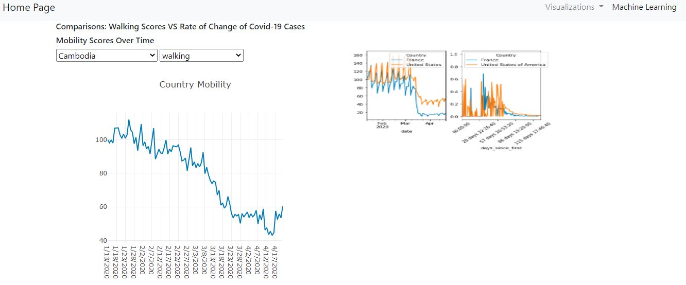
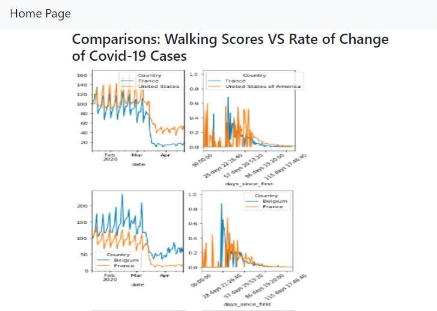

# Covid-Mobility

The relationship between mobility and covid-19 during QI of 2020 was investigated. We wanted to figure out whether subsequent shutdowns have affected people's mobility in different cities and countries around the world.

# Technologies Used:

Pandas, Python, Flask, SQL, Postgres, HTML, JavaScript, CSS, Plotly, Git, Github

# How to Run Code

1) Copy and paste this link https://final-covid-mobility.herokuapp.com/ into your browser

2) Enjoy!

# Data

- Mobility data was extracted from Apple in a csv. Mobility scores were given out of 100 depending on how frequently transit options (walking,driving,biking), would be searched in Apple Maps. 

- Covid-19 data was extracted from WHO also in csv format.

# Data cleaning, manipulation, and application development process:

- Mobility data was manipulated in pandas to be in first normal form.
- Mobility data was inserted into a Postgres database.
- A connection was established in Flask to serve up the mobility data
- to our javascript file
- A route to our html was established using Flask
- Graphs were created using plotly to demonstrate mobility trends over time in various countries

# Machine Learning:

Polynomial Graphs:

- Graphed each country by the length of the list (ie number of days) on the x-axis and cumulative cases on the y-axis in a 3rd-degree polynomial
- Used this model to be able to determine the number of days it would take to flatten the curve in different countries

Scatter Plots:

-Used growth rates and different transit types to try to predict the growth rate of the pandemic via transit, driving, and walking scores.
-Not a strong correlation found in current model.

# Screenshots

 Shows the trend among mobility data in various countries prior to the Covid-19 lockdown and afterwards. I wanted to demonstrate a decreasing trend over time and therefore, chose this interactive line chart. 

 Shows the comparision between mobility data amount various countries over time. I used a line chart comparison because I Wanted to see how countries stacked up against each other during the onset of the pandemic. 

 Demonstrates walking scores over time in two countries against rate of change of walking scores in two countries over time. I used graphs in Matplotlib because I had a lot of graphs to display that I wanted to condense to fit on one page. 

# Conclusions
- Determined the number of days it takes to flatten the coronavirus curve in various countries with existing data.
- Did not make a prediction as to how transit, driving, and biking scores can predict the growth of the pandemic.
